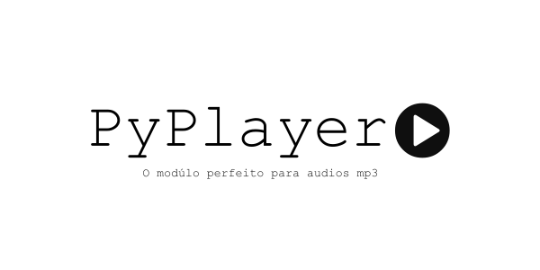

# Um modúlo perfeito para audios MP3


**PyPlayer** é um modúlo para manipulação de audios no formato **MP3**. O mesmo foi criado com o objectivo de ser um modúlo fácil de usar e completo no contexto de manipulação de MP3.

## O que o torna especial ?

O PyPlayer tende a ser especial porque cobrirá todas as **necessidades** que alguém que gostaria de criar um **player de audio** teria.

Com o Pyplayer será possível criar um player de audio completo sem usar um outro modúlo para audios que não seja o PyPlayer.

# Exemplo do Modúlo PyPlayer

```python
from PyPlayer import PlayerMixer as p

p.load(dir='D:/exemplo/mp3files');

p.play() # Este metódo toca a música corrente

p.pause() # Este metódo pausa a música corrente

p.restart() # Este metódo reinicia o player com o mesmo diretório
```

```python
from PyPlayer import PlayerMixer as p

p.load(file='D:/exemplo/mp3files/one.mp3');

p.play() # Este metódo toca a música corrente

p.pause() # Este metódo pausa a música corrente

p.restart() # Este metódo reinicia o player com o mesmo diretório
```
***Note que no primeiro exemplo passamos o caminho de um diretório para class `load()` usando o paramêtro `dir="path of folder with mp3 files"`. Já no segundo passamos o caminho de um arquivo  mp3 para a  class `load()` usando o paramêtro `file="path of mp3 files"`.***

# Metódos do PyPlayer

class | ação
:------- | :------
**load()** | <u>carrega os arquivos mp3</u>
 **play()** | <u>toca o arquivo em execução</u>
 **pause()** | <u>pausa a execução do arquivo em execução</u>
 **unpause()** | <u>descongela a execução do arquivo em execução</u>
 **stop()** | <u>para e reinicia a execução do arquivo em execução</u>
 **next_()** | <u>executa o proximo arquivo mp3 se houver</u>
 **back()** | <u>executa o arquivo anterior ao atual se houver</u>
 **repeat()** | <u>repete infinitamente o arquivo em execução</u>
 **currenttime()** |  <u>retorna o tempo atual do arquivo em execução</u>
 **settime** | <u>muda o tempo atual do arquivo em execução</u>
 **duration()** | <u>retorna o tempo total do arquivo em execução</u>
 **tags** | <u>retorna as tags do arquivo</u>
 |


# Estrutura do PyPlayer

O **PyPlayer** foi criado usando outros modúlos como, ´Pygame´; ´Mutagen´; ´Json´; ´Sqllite3´.
O foco não é só criar um modúlo perfeito para a execução de **arquivos mp3(e outros formatos no futuro)**, o foco é tornar o **PyPlayer** um modúlo útil na edição dos mesmos  e também na execução de **arquivos mp4(videos)**.

## Documentação

> O PyPlayer ainda está em desenvolvimento e por isso não existe online uma documentação legal para o mesmo.

## Participações

> Sendo um modúlo gratuito e open source todo mundo(Python Dev's) é convidado para contribuir.

**Copyright © - Eliseu Gaspar** 